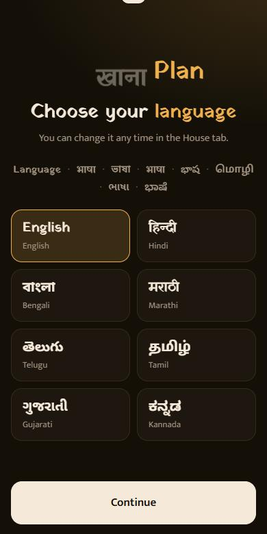
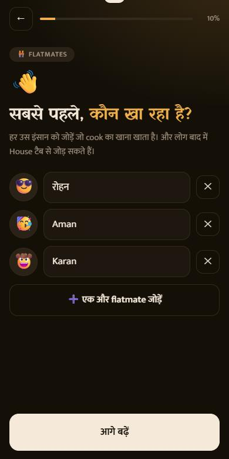
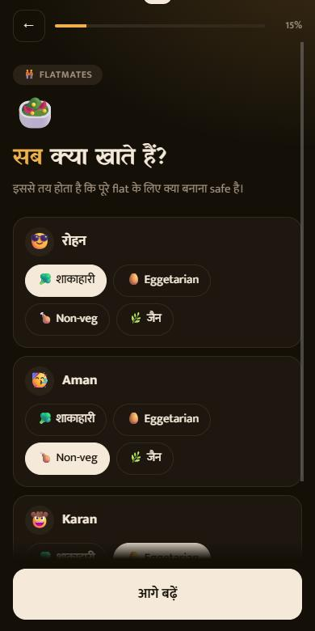
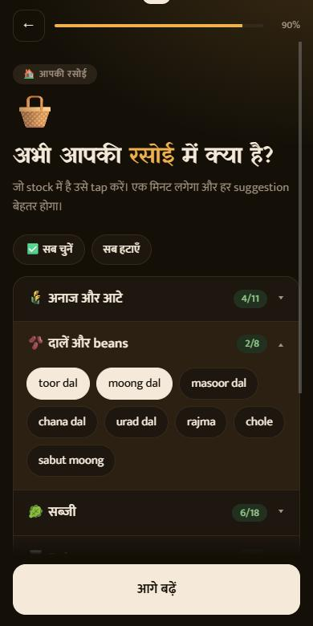
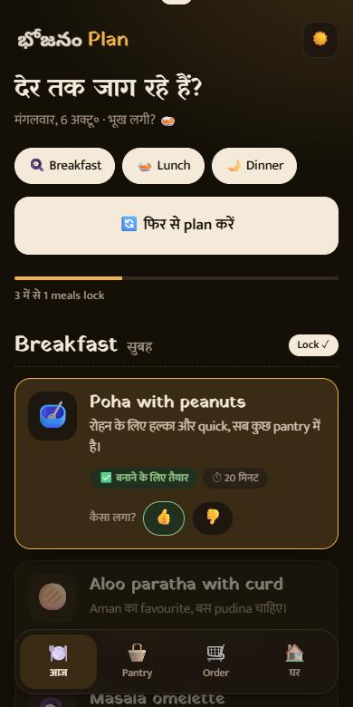

# खाना Plan · meal-planner

**An AI meal planner for flats with a cook.** Tell it who lives in the flat, what everyone eats and what's in the kitchen, and it tells you what the cook should make today, what can be cooked *right now*, and what needs to be ordered. It then writes the message for the cook.

It's a PWA built for phones. There is no backend and no build step, just static files and a Claude API key that stays on your device.

**Live:** https://meal-planner.avishekdas128.workers.dev

<p align="center">
  
  
  
  
  
</p>

## Features

- **Daily plan from Claude.** Three options per meal, each tagged ✅ *Ready to cook* or 🛒 *Need: paneer, palak*. Lock one and it's added to the history, so tomorrow's plan avoids repeats. 👍/👎 steers future picks.
- **Built for a whole flat.** Add every flatmate in one go. Each question then covers everyone: diet (veg, egg, non-veg, jain), spice, allergies, loves and hates, regional taste, health goals, breakfast style. Mixed diets are handled: shared dishes follow the strictest diet present.
- **Kitchen rules.** Cook's skill, time per meal, budget, veg-only days, how often dishes may repeat.
- **Pantry aware.** Tick what's in stock; missing items go to an order list. Mark one as bought and it moves into the pantry.
- **Tell the cook.** One tap shares the day's menu through the phone's share sheet, written in the flat's language.
- **8 languages.** English, हिन्दी, বাংলা, मराठी, తెలుగు, தமிழ், ગુજરાતી, ಕನ್ನಡ. Each one mixes in English words the way people really talk. The logo's "Khana" cycles through every script.
- **Dark by default**, with light and auto modes.
- **Installable and offline-capable.** The app shell is cached by a service worker.

## How it works

```
 phone (PWA)                                        Anthropic API
┌────────────────────────┐   POST /v1/messages    ┌─────────────┐
│ questionnaire → state  │ ─────────────────────▶ │ Claude      │
│ pantry · history       │ ◀───────────────────── │ (JSON schema│
│ localStorage           │   structured JSON       │  output)    │
└────────────────────────┘                         └─────────────┘
```

- The browser calls the Anthropic Messages API **directly**, with `output_config.format` (a JSON schema), so the reply is always valid, typed meal data.
- All state (flatmates, pantry, history, your API key) lives in **`localStorage` on the device**. There is no account, no server and no analytics.
- Model: `claude-sonnet-5-5` at low effort. Change `MODEL` in [`public/app.js`](public/app.js).

### A note on the API key

Because there is no backend, each user pastes **their own Anthropic API key** (get one at [console.anthropic.com](https://console.anthropic.com)). It is sent only to `api.anthropic.com`, and the Content-Security-Policy in [`public/_headers`](public/_headers) blocks requests to anywhere else. Still:

- Anyone with access to the device's browser storage can read the key. Use a key with a **spend limit** and don't use it on shared devices.
- If you'd rather hand a flat a link without asking everyone for a key, put a small proxy (for example a Cloudflare Worker that holds the key) in front of the API and point `fetch` in `ask()` at it.

## Run it locally

Requires Node 18+ (only for the static file server; the app itself has no dependencies).

```bash
git clone https://github.com/avishekdas128/meal-planner.git
cd meal-planner
npm run dev          # http://localhost:5178
```

Open it in your phone's browser on the same network, or use Chrome DevTools device mode. Service workers need `localhost` or HTTPS.

## Deploy to Cloudflare

The whole site is the [`public/`](public) folder. There is no build command.

**Option A: connect the GitHub repo (recommended; every push redeploys)**

1. Cloudflare dashboard → **Workers & Pages** → **Create** → **Import a repository** (or **Pages → Connect to Git**) and pick `meal-planner`.
2. Build command: *leave empty*. Deploy command: `npx wrangler deploy` (Workers) or, for Pages, **build output directory: `public`**.
3. Save and deploy. You get `https://meal-planner.<your-subdomain>.workers.dev` (or `*.pages.dev`).

**Option B: deploy from your machine**

```bash
npx wrangler login      # opens the browser once
npm run deploy          # uses wrangler.jsonc
```

After the first deploy, open the site on your phone and check **DevTools → Application** (or just try *Add to Home Screen*): the manifest should be valid and the service worker active.

## Project structure

```
public/                 the entire site (this is what gets deployed)
  index.html            shell: one <main>, tab bar, dialog
  app.js                state, questionnaire, rendering, Claude call
  i18n.js               language loading, per-script fonts, dates
  data.js               dishes, pantry items, constants
  styles.css            design tokens, light/dark, components
  sw.js                 service worker (stale-while-revalidate shell)
  theme-boot.js         applies the saved theme before first paint
  lang/*.js             one dictionary per language (en is the master)
  icons/, icon.svg      app icons
  manifest.webmanifest  PWA manifest
  _headers              security headers + CSP + cache rules (Cloudflare)
scripts/check-i18n.mjs  validates every translation file
wrangler.jsonc          Cloudflare config (serves ./public)
```

## Adding or fixing a language

1. Copy [`public/lang/hi.js`](public/lang/hi.js) to `public/lang/<code>.js` and translate the values. Keep `{placeholders}` and `<em>…</em>` as they are. A key you leave out falls back to English, which is how loanwords such as *Pantry* stay English.
2. Add the language to `LANGS` in [`public/i18n.js`](public/i18n.js): its code, native name, the local word for "food" (it animates in the logo), the word for "language", and a Noto Sans family if the script isn't Devanagari or Latin.
3. Add the file to the `SHELL` list in [`public/sw.js`](public/sw.js) so it works offline, and bump `CACHE`.
4. Run `npm run check:i18n`.

The translations were machine-assisted and have not all been reviewed by native speakers. Corrections are very welcome.

## Design notes

- **Mobile first.** Onboarding is a docked header, a scrolling middle and a docked footer, so nothing floats over content. Long pages (pantry, dish lists) collapse into an accordion or "+N more".
- **No framework.** Plain ES modules, template strings and event delegation. About 600 lines of JS.
- **Fonts.** Yatra One (headings) and Mukta (body) cover Latin and Devanagari; the other scripts use Noto Sans, loaded only for the chosen language.

## Known limitations

- Only 8 of India's languages so far, and no Urdu (it needs right-to-left layout).
- Pantry item and dish names stay in Roman script by design (like grocery apps).
- No sync between phones: each device keeps its own flat.

## Credits

- Emoji artwork: [Twemoji](https://github.com/jdecked/twemoji) by Twitter and contributors (the jdecked fork), licensed [CC-BY 4.0](https://creativecommons.org/licenses/by/4.0/). The SVGs in `public/emoji/` are bundled so emoji look identical on every phone; refresh them with `node scripts/build-emoji.mjs`.
- Fonts: Yatra One, Mukta and Noto Sans (SIL Open Font License), via Google Fonts.
- App icon and share image: drawn for this project.

## License

[MIT](LICENSE)
